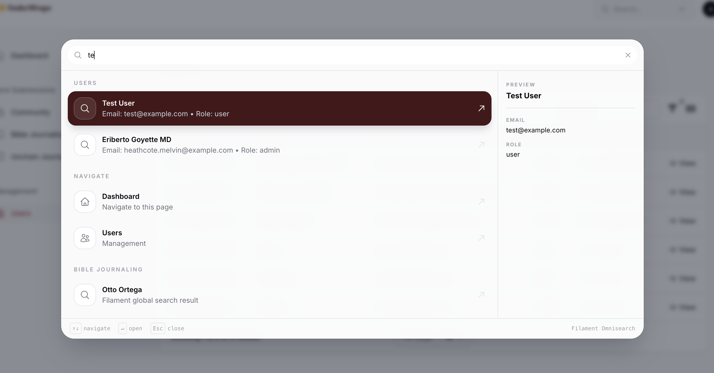

# Filament Omnisearch

A keyboard-first command palette for [Filament v5](https://filamentphp.com). Press `⌘K` / `Ctrl+K` from anywhere in your panel to instantly search navigation items, database records, resource actions, and custom commands — without leaving your current page.

Think of it as Spotlight or VS Code's command palette, built specifically for Filament. It replaces (or complements) Filament's native global search with a unified interface that covers everything: navigation, records, panel switching, page-specific actions, and any custom scope you register.

## Preview




## Features

- **Keyboard-driven** — Open with `⌘K` / `Ctrl+K`, navigate with arrow keys, execute with Enter, trigger actions with custom shortcuts
- **Built-in Scopes** — Navigation, Resources, Panels, Actions, and Page Actions out of the box
- **Extensible** — Add custom scopes by implementing `OmnisearchScope`
- **Record Preview** — Side panel showing resource field details when a result is active
- **Recent Searches** — Persisted per-browser with configurable toggle
- **Page Actions** — Auto-detect Create/List actions; discoverable from any page via search
- **Dark Mode** — Follows Filament's theme automatically
- **Fuzzy Search** — Smart matching with keyword support
- **Multilingual** — Built-in translations for English, Indonesian, and Dutch

## Requirements

- PHP 8.2+
- Laravel 11+
- Filament v5
- Livewire v4

## Installation

```bash
composer require ifsware/filament-omnisearch
```

Register the plugin in your Filament panel provider:

```php
use Ifsware\Omnisearch\OmnisearchPlugin;

public function panel(Panel $panel): Panel
{
    return $panel
        ->plugins([
            OmnisearchPlugin::make(),
        ]);
}
```

Publish the config file:

```bash
php artisan vendor:publish --tag="omnisearch-config"
```

---

## What Works Out of the Box

After installation and registration, opening the omnisearch palette (`⌘K` / `Ctrl+K`) gives you five built-in scopes automatically.

### 1. Navigation Scope

Searches all visible navigation items registered in the current panel. No configuration needed — every item in your sidebar is immediately searchable.

### 2. Resource Scope

Searches **records** across all resources that have Filament's global search enabled. A resource is searchable only when it declares at least one of:

- `$recordTitleAttribute` — the column used as the result title
- `getGlobalSearchResultDetails()` — method override returning fields shown in the subtitle and preview panel
- A custom `getGlobalSearchResults()` implementation

**Minimal example** — make a resource record searchable:

```php
class UserResource extends Resource
{
    protected static ?string $model = User::class;

    // Required: tells Filament which column is the record "name"
    protected static ?string $recordTitleAttribute = 'name';
}
```

**With detail fields shown in the preview panel:**

```php
class UserResource extends Resource
{
    protected static ?string $model = User::class;

    protected static ?string $recordTitleAttribute = 'name';

    // These fields appear in the side preview when a result is highlighted
    public static function getGlobalSearchResultDetails(Model $record): array
    {
        return [
            'Email' => $record->email,
        ];
    }
}
```

> If `$recordTitleAttribute` is not set and `getGlobalSearchResultDetails()` is not implemented, the resource will not appear in omnisearch results.

### 3. Panel Scope

Lists other Filament panels the authenticated user has access to. Useful in multi-panel applications (e.g. admin + customer portal). Results appear even without a search query, so users can switch panels from the palette.

### 4. Action Scope

Shows global actions registered on the plugin (see [Global Actions](#global-actions) below). Actions appear without a search query so they are always discoverable.

### 5. Page Actions Scope

Automatically discovers **Create** and **List** actions for every resource whose pages use the `HasOmnisearchPageActions` trait. Unlike the per-page chip, these results appear in **search results from any page** — not only when the user is currently on that resource's page.

---

## Global Actions

Register application-level actions on the plugin using `OmnisearchAction`. Actions appear in the **Actions** group and can run any PHP callable.

```php
use Ifsware\Omnisearch\OmnisearchPlugin;
use Ifsware\Omnisearch\OmnisearchAction;

OmnisearchPlugin::make()
    ->actions([
        OmnisearchAction::make('clear-cache')
            ->title('Clear Application Cache')
            ->subtitle('Run artisan cache:clear')
            ->icon('heroicon-o-trash')
            ->keywords(['cache', 'clear', 'flush'])
            ->shortcut('mod+shift+c')
            ->action(fn () => \Artisan::call('cache:clear')),

        OmnisearchAction::make('go-profile')
            ->title('My Profile')
            ->subtitle('Open your profile settings')
            ->icon('heroicon-o-user')
            ->keywords(['profile', 'account', 'settings'])
            ->shortcut('mod+shift+u')
            ->action(fn () => redirect()->to(Filament::getProfileUrl() ?? '/admin')),
    ]);
```

`OmnisearchAction` fluent API:

| Method | Description |
|--------|-------------|
| `title(string)` | Display title in the palette |
| `subtitle(string)` | Secondary text below the title |
| `icon(string)` | Heroicon name, e.g. `heroicon-o-bolt` |
| `keywords(array)` | Extra words used for fuzzy matching |
| `shortcut(string)` | Keyboard shortcut — shown as a badge in the result **and** registered as an active hotkey (see [Keyboard Shortcuts](#keyboard-shortcuts)) |
| `action(callable)` | PHP callable invoked when the action is executed |

---

## Page Actions

Add `HasOmnisearchPageActions` to a resource page to expose **Create** and **List** actions in two places:

1. **Topbar chip** — shown while the user is on that page, for quick one-click access
2. **Search results** — available from any page via `OmnisearchPageActionsScope` (see [built-in scopes](#5-page-actions-scope))

```php
use Ifsware\Omnisearch\Concerns\HasOmnisearchPageActions;

class ListUsers extends ListRecords
{
    use HasOmnisearchPageActions;

    protected static string $resource = UserResource::class;
}
```

You only need to add the trait to **one page** per resource (typically the list page). The `OmnisearchPageActionsScope` scans all resource pages automatically, so Create/List actions will appear in search results regardless of which page the user is currently on.

When the page is active, omnisearch will show in the topbar:

- **Create User** — links to the resource create page (if it exists)
- **Users** — links back to the resource index (if it exists)

### Adding Custom Page Actions

Override `getOmnisearchActions()` to inject page-specific actions alongside the auto-detected ones. A `shortcut` key registers an active keyboard hotkey — but only **while the user is on that page**:

```php
class EditUser extends EditRecord
{
    use HasOmnisearchPageActions;

    protected static string $resource = UserResource::class;

    protected function getOmnisearchActions(): array
    {
        return [
            [
                'id'       => 'page.send-welcome',
                'type'     => 'action',
                'group'    => 'Page',
                'title'    => 'Send Welcome Email',
                'subtitle' => 'Dispatch a welcome email to this user',
                'icon'     => 'heroicon-o-envelope',
                'keywords' => ['email', 'welcome', 'send'],
                'shortcut' => 'mod+shift+e',    // active only on this page
            ],
        ];
    }
}
```

> For a shortcut that works from **every page**, register the action via `OmnisearchPlugin::make()->actions([...])` instead — global actions are always mounted.

---

## Custom Scopes

Implement `OmnisearchScope` to add any results you want. Each item must have a `type` of `url`, `action`, or `modal`.

### URL item — navigates to a page

```php
use Ifsware\Omnisearch\Contracts\OmnisearchScope;

final class SettingsScope implements OmnisearchScope
{
    public function isActive(): bool
    {
        return true; // return false to disable this scope conditionally
    }

    public function getItems(string $query, array $context): array
    {
        return [
            [
                'id'       => 'settings.general',
                'type'     => 'url',
                'group'    => 'Settings',
                'title'    => 'General Settings',
                'subtitle' => 'Open the general settings page',
                'icon'     => 'heroicon-o-cog-6-tooth',
                'keywords' => ['settings', 'general', 'config'],
                'url'      => '/admin/settings',
            ],
        ];
    }
}
```

### Action item — runs a PHP callable server-side

```php
[
    'id'       => 'actions.export',
    'type'     => 'action',
    'group'    => 'Actions',
    'title'    => 'Export Users',
    'subtitle' => 'Download all users as CSV',
    'icon'     => 'heroicon-o-arrow-down-tray',
    'keywords' => ['export', 'csv', 'download'],
    'action'   => fn () => \Artisan::call('export:users'),
]
```

### Modal item — opens a Livewire modal

```php
[
    'id'       => 'modal.invite',
    'type'     => 'modal',
    'group'    => 'Actions',
    'title'    => 'Invite User',
    'subtitle' => 'Open the invite user dialog',
    'icon'     => 'heroicon-o-user-plus',
    'keywords' => ['invite', 'user', 'add'],
    'modalId'  => 'invite-user-modal',
]
```

### Register the scope

Add it to `config/omnisearch.php`:

```php
'scopes' => [
    \Ifsware\Omnisearch\Scopes\OmnisearchNavigationScope::class,
    \Ifsware\Omnisearch\Scopes\OmnisearchResourceScope::class,
    \Ifsware\Omnisearch\Scopes\OmnisearchPanelScope::class,
    \Ifsware\Omnisearch\Scopes\OmnisearchActionScope::class,
    \Ifsware\Omnisearch\Scopes\OmnisearchPageActionsScope::class,
    \App\Omnisearch\SettingsScope::class, // your custom scope
],
```

---

## Configuration

```php
// config/omnisearch.php

return [
    // Set to false or OMNISEARCH_ENABLED=false in .env to disable entirely
    'enabled' => env('OMNISEARCH_ENABLED', true),

    // Active scopes — order determines result order in the palette
    'scopes' => [
        \Ifsware\Omnisearch\Scopes\OmnisearchNavigationScope::class,
        \Ifsware\Omnisearch\Scopes\OmnisearchResourceScope::class,
        \Ifsware\Omnisearch\Scopes\OmnisearchPanelScope::class,
        \Ifsware\Omnisearch\Scopes\OmnisearchActionScope::class,
        \Ifsware\Omnisearch\Scopes\OmnisearchPageActionsScope::class,
    ],

    // Maximum number of results returned across all scopes
    'max_results' => 50,

    // Keyboard shortcut to open the palette (mod = Cmd on Mac, Ctrl on Windows/Linux)
    'shortcut' => 'mod+k',

    // Set a string to override the placeholder for all locales,
    // or leave null to use the translation file (default).
    'placeholder' => null,

    // Group labels shown as section headers in the palette.
    // Leave null to use the translation file (default).
    'groups' => [
        'navigate' => ['label' => null, 'subtitle' => null],
        'actions'  => ['label' => null],
        'page'     => ['label' => null],
    ],

    'recent_searches' => [
        'enabled' => true,
        'label'   => null,      // leave null to use translation file (default)
        'max'     => 5,         // maximum number of recent searches to show
    ],

    'empty_state' => [
        'message'     => null,  // leave null to use translation file (default)
        'suggestions' => ['dashboard', 'users', 'settings'],
    ],
];
```

### Plugin options

```php
OmnisearchPlugin::make()
    // Pass false to keep Filament's native global search bar visible
    ->disableDefaultGlobalSearch(false)
    ->actions([/* OmnisearchAction instances */]);
```

---

## Multilingual Support

Filament Omnisearch ships with built-in translations for **English** (default), **Indonesian**, and **Dutch**. All UI strings — including placeholders, group labels, empty state messages, and footer shortcuts — are translatable.

### Publish translations

```bash
php artisan vendor:publish --tag="omnisearch-translations"
```

This copies the language files to `resources/lang/vendor/omnisearch/{en,id,nl}/`. Edit them to customize wording or add new locales.

### Override via config

You can still override specific strings globally via `config/omnisearch.php`. When a config value is set to a non-empty string, it takes precedence over the translation file.

```php
'placeholder' => 'Type to search...',   // overrides translation file
'groups' => [
    'navigate' => ['label' => 'Go to', 'subtitle' => null], // mixed usage
],
```

### Adding a new language

1. Copy `resources/lang/en/omnisearch.php`
2. Place it under `resources/lang/vendor/omnisearch/{locale}/omnisearch.php`
3. Translate the values

No code changes are required — Laravel's localization system will pick up the new locale automatically.

---

## Keyboard Shortcuts

### Built-in

| Key | Action |
|-----|--------|
| `⌘K` / `Ctrl+K` | Open omnisearch |
| `Escape` | Close omnisearch |
| `↑` / `↓` | Navigate results |
| `↵` | Execute selected result |

### Custom action shortcuts

Shortcuts defined via `->shortcut()` or the `shortcut` key in an item array are **active hotkeys** — pressing them executes the action directly without opening the palette first.

**Scope of custom shortcuts:**

| Where defined | Active |
|---|---|
| `OmnisearchPlugin::make()->actions([...])` | All pages, always |
| `getOmnisearchActions()` on a page | Only while on that page |

**Shortcut format** — use `+`-separated modifiers followed by a key:

```
mod+k          // ⌘K on Mac, Ctrl+K on Windows/Linux
mod+shift+u    // ⌘⇧U / Ctrl+Shift+U
alt+p          // ⌥P / Alt+P
```

`mod` resolves to `Cmd` on Mac and `Ctrl` on Windows/Linux. Other modifiers: `ctrl`, `meta`, `shift`, `alt`.

> **Avoid browser-reserved shortcuts.** Common conflicts: `mod+shift+n` (new incognito, Chrome), `mod+shift+p` (private window, Firefox), `mod+shift+j` (DevTools console), `mod+shift+i` (DevTools). Browser UI shortcuts are captured before the page sees them and cannot be overridden with `preventDefault()`.

---

## Testing

```bash
composer test
```

## License

MIT
